# Quickstart LS-Dyna

## Introduction

You will need:

* LS-Dyna
* LS-Prepost

---

## First Simulation on a Local Machine

We will first create a simulation and run it on your current computer.

1. Launch **LS-Prepost**

2. Go to:
   `Mesh > ShapeMesher > Create > Accept > Done`

[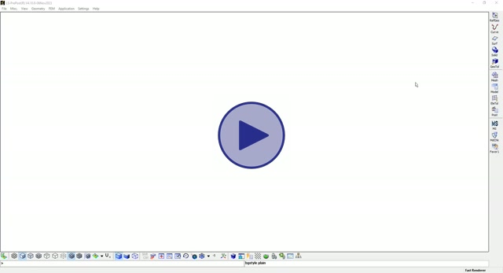](assets/Quickstart.md/1.mp4)

3. Create two node sets:

   * One fixed
   * One displaced (traction)

[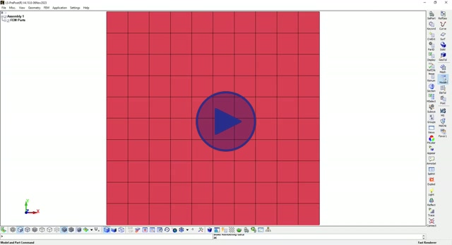](assets/Quickstart.md/2.mp4)

4. Go to keyword `*PART`:

   * Create and assign a section to the mesh elements

[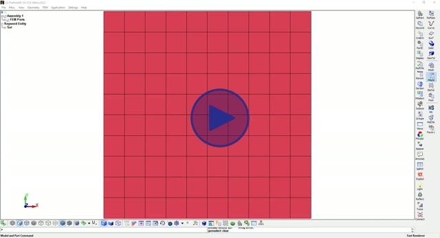](assets/Quickstart.md/3.mp4)

5. Create and assign an elastic material:

   * ρ = 1340 kg/m³
   * E = 3000 Pa

[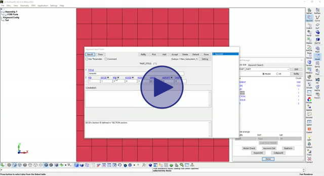](assets/Quickstart.md/4.mp4)

6. Accept the changes in the PART

7. Create constraints:

   * Fixed displacement → lower node set

[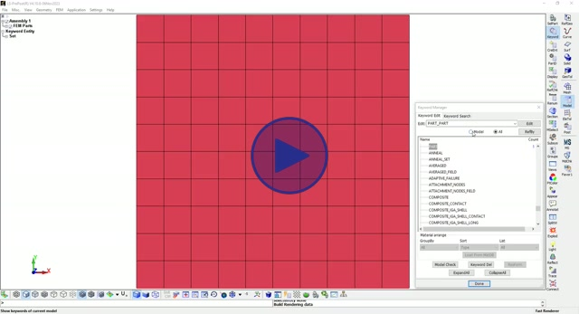](assets/Quickstart.md/5.mp4)
   * Constant velocity (1 m/s in Y direction) → upper node set

[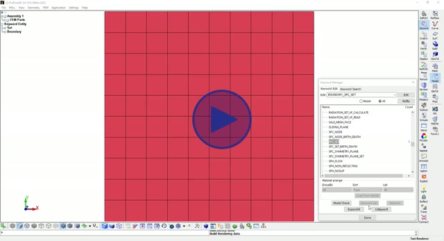](assets/Quickstart.md/6.mp4)

8. Create simulation settings:

   * Termination: `t = 1s`

[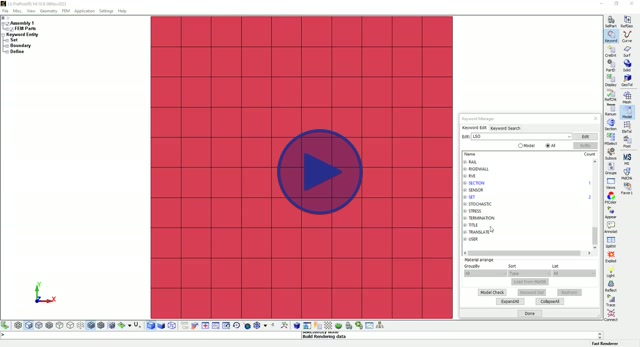](assets/Quickstart.md/7.mp4)
   * Initial timestep: `0.1s`

[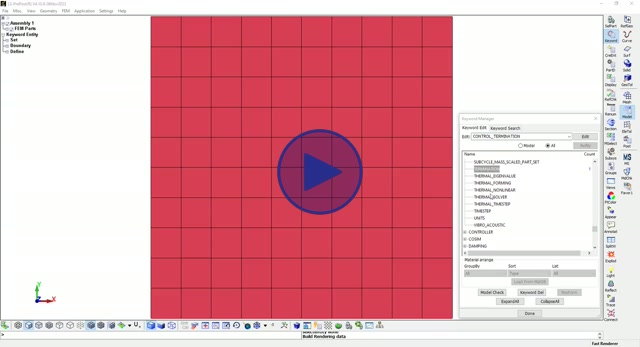](assets/Quickstart.md/8.mp4)
   * d3plot export every `0.1s`

[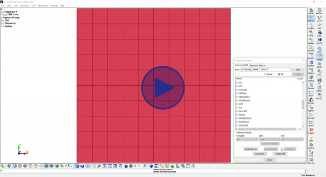](assets/Quickstart.md/9.mp4)

9. Save file:

   ```
   test_simu.k
   ```

10. Run simulation using **LS-Run** (in LS-Prepost directory)

[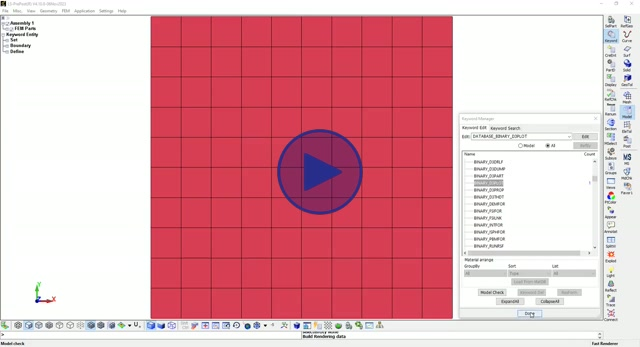](assets/Quickstart.md/10.mp4)

11. Check results via **LS-Prepost** (d3plot)

[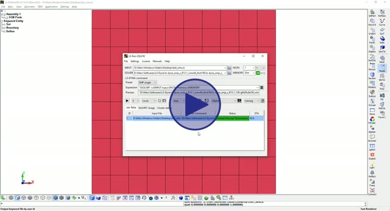](assets/Quickstart.md/11.mp4)