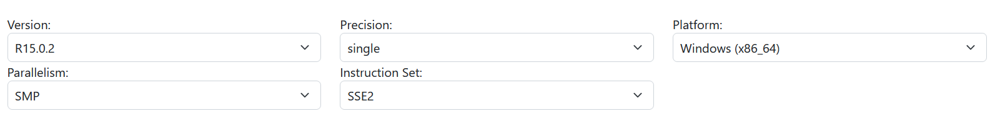
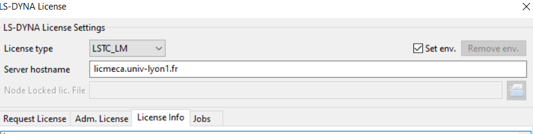

# LS-Dyna and LS-PREPOST Installation Guide
Download LS-PREPOST and LS-Dyna from https://ftp.lstc.com/anonymous/outgoing/lsprepost and https://ftp.lstc.com/user/download_page.html  
username: user  
password: computer

For LS-PREPOST version :
take the latest version available

For LS-Dyna version :  

LS-PREPOST comes with LS-Run software (to run simulations). Use it to launch simulations.

For licenses :  
  
You need to be on the Lyon 1 network or to use the Lyon 1 VPN.

For a quickstart with LS-Dyna, check the Quickstart.md file in the repository. It will guide you through the steps to create and run a simulation with LS-Dyna and LS-Prepost.

# FE Model Overview

## Description
This finite element model simulates the dynamic interaction between a **rigid cylinder** and a **deformable soft surface**. The cylinder undergoes periodic vertical oscillation at a fixed frequency, repeatedly making contact with the underlying surface and inducing vibration response.

## Model Components

### Geometry
- **Rigid Cylinder**: A solid cylindrical impactor (Part 4) designed to strike the surface repeatedly
- **Soft Deformable Surface**: A compliant elastic substrate (Part 3) with low stiffness that absorbs impact energy and vibrates in response to loading
- **Fixed Support Base**: An elastic foundation layer (Part 2) beneath the deformable surface

### Materials
- **Cylinder**: Rigid material (MAT_RIGID) with density 0.006 for efficient computation of rigid body motion
- **Soft Surface**: Linear elastic material (MAT_ELASTIC) with very low Young's modulus (E = 0.001) and density 0.001, providing high compliance
- **Support Base**: Linear elastic material with Young's modulus E = 0.01 and density 0.001

### Loading and Motion
- **Prescribed Motion**: The cylinder oscillates vertically with a **sinusoidal displacement pattern** following a load curve with period T = 10 time units
- **Amplitude**: Peak displacement of ±4.76 units (scaled by 1.5 factor)
- **Frequency**: 0.1 Hz (1 complete cycle every 10 time units)
- **Duration**: 200 time units (20 complete oscillation cycles)

### Unit System
The following **consistent unit system** is used:
- **Length**: Millimeters (mm)
- **Time**: Milliseconds (ms)
- **Mass**: Grams (g)
- **Density**: g/mm³
- **Stress/Pressure**: MPa
- **Frequency**: 100 Hz (1 cycle per 10 ms)

### Contact Mechanics
- **Automatic Surface-to-Surface Contact** between the cylinder and the soft surface